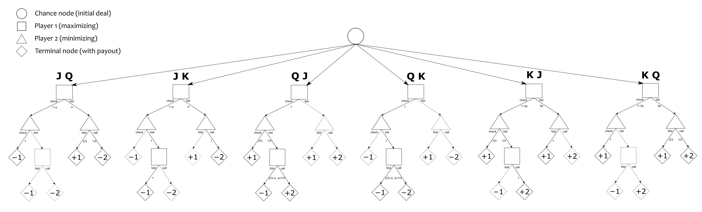

## **Motivation**
This is another small project in my quest to learn more about incomplete information games and how reinforcement learning can be used to converge at their optimal strategies.
I have previously implemented the counterfactual regret minimization algorithm for rock-paper-scissors and gained insights on the essence of the algorithm and how it achieves its goal, and
here I decided to implement it on a slightly more complex game called Kuhn Poker.

## **How it works**
First a little bit about Kuhn Poker from my good friend ChatGPT:  

Kuhn Poker is one of the simplest models of a poker game. It was invented by Harold W. Kuhn in 1950 as a way to study strategic decision-making in imperfect-information games.
Because it is small and mathematically tractable, it’s often used in game theory, AI, and poker research as a “toy game” to test strategies like Nash equilibrium and Counterfactual
Regret Minimization (CFR).

Here’s how it works:

### *Setup*
- Players: 2
- Deck: Only 3 cards (commonly Jack, Queen, King or just numbered 1, 2, 3).
- Antes: Each player antes (pays) 1 chip to the pot before cards are dealt.
- Deal: Each player is dealt 1 card (face-down, privately known to them).

### *Betting Rules*
- There is only one round of betting.
- Player 1 (the first to act) can either:
  - Check (bet nothing, pass the option to Player 2), or
  - Bet (wager 1 more chip).

- Player 2 then responds:
  - If Player 1 checked, Player 2 may check back (end betting) or bet.
  - If Player 1 bet, Player 2 may fold (losing the ante) or call (matching the bet).

### *Showdown*
- If betting ends without a fold, both reveal their cards.
- The higher card wins the pot.

### *Payoffs*
- Each player starts with -1 chip (the ante).
- Bets and calls add more chips to the pot.
- The winner takes the pot.

### *Strategy Insights*
- Bluffing exists even in this tiny game. For example, a player holding the lowest card sometimes bets to represent strength and force a fold.
- Mixed strategies are required for optimal play. A Nash equilibrium involves randomization—e.g., betting weak hands with some probability and calling with medium hands part of the time.
- Despite only 3 cards, the game is deep enough to illustrate key ideas in poker: value betting, bluffing, and balance.

Now that we know about Kuhn Poker, let me explain the counterfactual regret minimization algorithm on a high level:  
The CFR algorithm essentially involves self-play, countless times, and in each iteration of the game, the bot compares it's expected pay off from taking various actions,
and quantifies how much it regrets not taking certain actions (with respect to the cumulative expected value of that decision point) in the game tree. It weights these regrets based on the probability of arriving at those information sets due to the opponent (assuming the opponent uses an identical strategy). As the algorithm calculates it's regrets at each infoset, it updates it's strategy at that infoset such that it chooses each action with a probability that is proportional to the running sum of regret values for that action. With each updated strategy at each infoset, it stores a sum of strategies for each infoset and the average of these strategies is what converges to the nash equilibrium strategy, which is the most optimal strategy that guarantees the player to not lose in expectation.  

To investigate the more specific implementation of the algorithm for Kuhn Poker we must first take a look at it's game tree:  

In our implementation, we first create a Node class that represents an information set (infoset). An infoset is, surprise surprise, the set of information that is available to a player at a given decision point in the game tree. It is different to a node that you see in the game tree, as for a single information set you can be at multiple nodes/game-states. For example, if you look at the leftmost subtree and the rightmost subtree that each stem from the chance node in our game tree, in both cases, player 2 is dealt a Queen, whereas in the leftmost case player 1 has a Jack and in the rightmost case player 1 has a King. If we say that player chooses to bet in both cases, we descent to different player 2 nodes for each subtree, however both these nodes are part of the same infoset for player 2. This is because in both cases, player 2 has the same information i.e. I was dealt a queen and player 1 bet. Because of this, player 2 cannot differentiate between the two gamestates and must apply the same strategy in both these cases. In our Node class, we store the infoset that it is for, the current strategy for that infoset, and the sum of regrets and strategies accumulated for that particular infoset. We traverse this game tree recursively, calculating the regret values for each action and updating our strategies at the respective decision points simultaneously. If you want to understand how the recursive function works it's easier to look at the code since I have included alot of comments explaining it. After many iterations, the average strategy at each infoset is calculated and that is the approximate nash equilibrium solution for Kuhn Poker.  

## *How to use it*
There are 2 files.  
### Kuhn_poker_cfr.py  
It is pretty straightforward. To train the program you just need to enter the number of iterations you want it to run as the argument of the train function and then run the program. The program output should be:
1) The average game value for player 1: -1/18 ≈ -0.0556. This means that the average number of chips lost by player 1 per hand in the nash equlibrium state is 1/18, and therefore player 2 gains an average if 1/18 chips per hand since this is a 2 player zero-sum game. What this tells us is that player 1 is at a natural disadvantage and so loses money in expectation assuming optimal play.
2) The strategy for each infoset. The strategy follows the following format:
   - infoset: [probability of checking, probability of betting]
  Something interesting that I noticed while running the program multiple times was that while the strategies at most infosets remained identical each time I trained it, there were fluctuations in the strategies at the infosets "3" and "1" (Player 1 is dealt a King, and Player 1 is dealt a Jack). This is because there exists a range of nash equilibria for Kuhn Poker that follow the following rules:
  - The probability with which Player 1 bluffs (bets) when dealt a jack can lie anywhere between 0 and 1/3
  - The probability with which Player 1 value bets (bets) with a king must be 3 times their probability of bluffing with a Jack.

You can observe this pattern yourself when you train the program. The extrema of this range are as follows:  
- As player 1, you never bluff with a jack, and therefore always slow play your kings. This way your opponent cannot tell if you have a king or a jack whenever they are dealt a queen as player 2, and therefore you remain elusive and they may sometimes fold when you have a jack (thinking you have a king) or bet when you have a king (thinking you have a jack).
- As player 1, you bluff with a jack 1/3 of the time, and you value bet with a king all the time. This way your opponent will often fall for your bluffs as in their experience you usually have a king when you bet first.

I find it fascinating that these distinct strategies give you the same mathematical edge over your opponent.

### Kuhn_poker_game.py  
Here I have coded a CLI Kuhn Poker game that allows you to play against a bot that follows 1 of the nash equilibrium strategies of this game. You start with choosing the buy in chips, and the game begins. I have made it so that Player 1 and Player 2 alternate between you and the bot so that no one has a chronic advantage (Player 2 is a mathematically advantageous positon). To feel the true power of the bot I recommend playing with a larger buy-in of about 15-20 chips, so that there are enough hands played that the luck evens out and you can truly appreciate the strength of the bots strategy.

